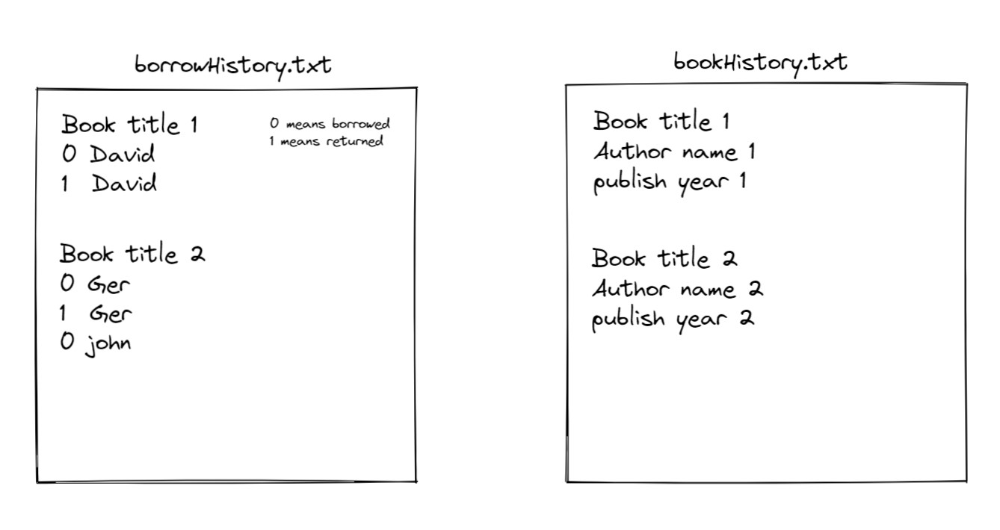

# Library Management Program
## รายละเอียดเกี่ยวกับโปรเจค
คำอธิบายสั้นๆ: โปรเจคนี้เป็นส่วนหนึ่งในวิชา CPE100: Computer Programming for Engineers ภาคการศึกษาที่ 1 ปีการศึกษา 2022 โดยจะเป็นโปรเจคที่ให้เราพัฒนาโปรแกรมช่วนในการบริหารจัดการห้องสมุด 
โดยจะมีฟังก์ชั่นการทำงานหลัก ดังนี้
- สามารถเพิ่ม-ลบหนังสือในห้องสมุดได้
- สามารถแก้ไขรายละเอียดของหนังสือ (ชื่อหนังสือ, ชื่อผู้แต่ง, ปีที่พิมพ์) ได้
- สามารถค้นหาหนังสือจากชื่อหนังสือและ/หรือชื่อผู้แต่งได้
- มีระบบการยืม-คืนหนังสือ โดยไม่จํากัดจํานวนครั้งในการยืม-คืนของหนังสือแต่ละเล่ม
- จัดเก็บข้อมูลลงไฟล์โดยอัตโนมัติโดยเมื่อเปิด-ปิดโปรแกรมใหม่รายละเอียดหนังสือและรายการยืมคืนทั้งหมด
  จะต้องยังคงอยู่

### สมากชิกกลุ่ม:
1. นายชยพล วงศ์ภูวรักษ์ 65070501011
2. นายรุดฟาน ไมมะหาด 65070501049
3. นายศิวราช เหลาพรม 65070501052
4. นายดนัย แสงบัวหมัด 65070501076
---

## รายละเอียดของโปรแกรม

* ## main.c
  * ### การทำงานหลักของโปรแกรม
    1. ทำการสร้างรายการหนังสือ BookList เพื่อที่จะเก็บข้อมูลหนังสื้อ และประวัติการยืม-คืนเอาไว้
       ```c
        LIST_T *BookList = listCreate(1); // สร้าง list ของหนังสือใน ห้องสมุด
        
       ```
    2. ทำการอ่านข้อมูลจากไฟล์ประวัติที่บันทึก แล้วบันทึกไว้ในตัวแปร BookList
       ```c
        char *bookfilepath = "bookHistory.txt"; 
        char *borrowfilepath = "borrowHistory.txt";
        char *saveBookHistoryFilePath = "bookHistory.txt";
        char *saveBorrowHistoryFilePath = "borrowHistory.txt";
        // โหลดข้อมูลจากไฟล์ที่ save ไว้
        bookCreateFromtxt(BookList, bookfilepath); 
        borrowListCreateFromtxt(BookList,borrowfilepath); 

       ```
    3. เริ่มการทำงานของ Loop
    4. ทำการปริ้นตารางข้อมูลหนังสือที่มีอยู่ใน BookList
    5. ให้ผู้ใช้เลือกรายการตัวเลือกที่ต้องการ
    6. วนซ้ำข้อ c->e จนกว่าผู้ใช้จะเลือกตัวเลือกที่ 8
    7. เมื่อผู้ใช้เลือกตัวเลือกที่ 8 โปรแกรมจะทำการ เซฟไฟล์ข้อมูลประวัติทั้งหมดจากนั้นออกจาก Loop
    8. จบการทำงานของโปรแกรม
    ```c
            while (1)
          {
            printBookTable(BookList);    
            printf("\n");     
            char temp_option[MAX_OPTION_LENGTH]; //เก็บค่า option เป็น char ก
            int selected_choice = 0;
            printf("[ Menu ]\n");
            printf("1) Add book\n");
            printf("2) Remove book\n");
            printf("3) Edit book\n");
            printf("4) Show all book\n");
            printf("5) Search book\n");
            printf("6) Borrow book\n");
            printf("7) Return book\n");
            printf("8) Exit\n");
            fgets(temp_option, MAX_OPTION_LENGTH, stdin);
            selected_choice = atoi(temp_option);
        
            if (selected_choice == 1)
            {
              printf("\n-----[ You selected Add Book option ]-----\n");
              BOOK *b1 = bookCreate();
              listAppend(BookList, b1);
            }
            else if (selected_choice == 2)
            {
              printf("\n-----[ You selected Remove book option ]-----\n");
              bookListRemoveByTitle(BookList);
            }
            else if (selected_choice == 3)
            {
              printf("\n-----[ You selected Edit Book option ]-----\n");
              bookEdit(BookList);
            }
            else if (selected_choice == 4)
            {
              printf("\n-----[ You selected Show All Book option ]-----\n");
              bookListShow(BookList);
            }
            else if (selected_choice == 5)
            {
              printf("\n-----[ You selected Search option ]-----\n");
              bookSearch(BookList);
            }
            else if (selected_choice == 6)
            {
              printf("\n-----[ You selected Borrow option ]-----\n");
              borrowBook(BookList);
            }
            else if (selected_choice == 7)
            {
              printf("\n-----[ You selected Return option ]-----\n");
              returnBook(BookList);
            }
            else if (selected_choice == 8)
            {
              printf("\n-----[ You selected Exit option ]-----\n");
              saveBookList(BookList, saveBookHistoryFilePath);
              saveBorrowList(BookList, saveBorrowHistoryFilePath);
              printf("The data had been saved \nsee you later goodbye :) \n");
              break;
            }
            else
            {
              continue;
            }
            printf("---------------------------------\n");
            fflush(stdin);
          }
    ```
      
* ## library.c และ librarry.h
  * ### Function การเข้าถึงค่าของข้อมูลภายในlistของหนังสือ
    * __Function 1: เข้าถึงค่าของ status การยืม-คืน__
      ```c
        int getOptionValueByIndex(LIST_T* list,int book_index ,int index); 

      ```
      ดึงค่าภายใน list ตำแหน่งที่ index จาก Option ที่อยู๋ในหนังสือที่ book_index
      
    * __Function 2: เข้าถึงชื่อของผู้ทำการยืม-คืน__
      ```c
        char* getNameValueByIndex(LIST_T* list,int book_index , int index);
      ```
      ดึงค่าภายใน list ตำแหน่งที่ index จาก Name ที่อยู๋ในหนังสือที่ book_index
      
    
    * __Function 3: เข้าถึงรายการสถานณะการยืม-คืน__
      ```c
        LIST_T* getOptionListByIndex(LIST_T* list, int index); 
      ```
      ดึง List of Option จาก List ของหนังสือลำดับที่ index จาก list
    
    
    * __Function 4: เข้าถึงรายการชื่อผู้ทำการยืม-คืน__
      ```c
        LIST_T* getNameListByIndex(LIST_T* list,int index); 
      ```

      ดึง List of Name ของหนังสือลำดับที่ index จาก list
      
    * __Function 5: เข้าถึงหนังสือ ที่อยู่ในรายการหนังสือ__
      ```c
        BOOK *getBookByIndex(LIST_T *list, int index); 
      ```
      ดึง BOOK Struct จาก List ตำแหน่งที่ index
  ---
  * ### Function ใช่ในการอ่านค่าจากไฟล์เซฟ
    * #### **ฟังก์ชั่นในการอ่านไฟล์ข้อมูลหนังสือที่ทำการเซฟไว้ก่อนหน้า**
      ```c
        LIST_T *bookCreateFromtxt(LIST_T *list,char *filepath); 
      ```
      อ่านค่าและสร้าง list ของหนังสือจากไฟล์
      
      ```c
        BOOK *booKCreateAuto(char title[60], char author[60],char year[60]);
      ```
      สร้าง BOOK struct จากค่าที่ส่งมาจากฟังก์ชั่น bookCreateFromtxt
      
    
    * #### **ฟังก์ชั่นในการอ่านไฟล์ประวัติการยืม-คืนที่ทำการเซฟไว้ก่อนหน้า**
      ```c
        LIST_T *borrowListCreateFromtxt(LIST_T *list, char *filepath);
      ```
      อ่านข้อมูลประวัติการยืม-คืนหนังสือจากไฟล์
          
  ---
  * ### Function จัดการข้อมูลของหนังสือ
      ---
    * #### Manually creating book from user input: 
      ```c
      BOOK *bookCreate();
      ```
      ฟังก์ชันนี้ใช้สร้างรายละเอียดของหนังสือตามข้อมูลในstructureด้วยตนเองก่อนที่จะเพิ่มลงในรายการหนังสือ
    
    * #### Showing all the book in booklist: 
      ```c
      void bookListShow(LIST_T *list);
      ```
      ฟังก์ชันนี้ใช้แสดงหนังสือที่อยู่ในรายการหนังสือ 
  
    * #### Removing book from booklist:
      ```c
      void bookListRemoveByTitle(LIST_T *list);
      ```
      ฟังก์ชันนี้ใช้ลบหนังสือจากรายการหนังสือ โดยอ้างอิงจากชื่่อหนังสือ
      
    * #### Editing book:
      ```c
      void bookEdit(LIST_T *list);
      ```
      ฟังก์ชันนี้ใช้เพื่อแก้ไขข้อมูลหนังสือ

    * #### Searching book:
      ```c
      void bookSearch(LIST_T *list);
      ```
      ฟังก์ชันนี้ใช้เพื่อค้นหาหนังสือ
      
    
    * #### Borrowing book:
      ```c
      void borrowBook(LIST_T* list);
      ```
      ฟังก์ชันนี้ใช้เพื่อทำรายการยืมหนังสือ
    

    * #### Returning book:
      ```c
      void borrowBook(LIST_T* list);
      ```
      ฟังก์ชันนี้ใช้เพื่่อทำรายการยืมหนังสือ

    ---
    
    

  * ### Function เซฟข้อมูลไฟล์
    * #### Saving booklist data for the next time:
    ```c 
    void saveBookList(LIST_T *list, char *filepath);
    ```
    เขียนข้อมูลหนังสือ เซฟไว้ใน filepath ที่กำหนด

    * #### Saving borrowing and returning list data for the next time:
    ```c 
    void saveBorrowList(LIST_T *list, char *filepath);
    ```
    เขียนข้อมูลการยืม-คืน เซฟไว้ใน filepath ที่กำหนด

    ---


  * ### Function ช่วงการทำงานของ Function หลัก
    * #### clearing memory of book:
      ```c
      void bookDestroy(BOOK *book);
      ```
      ฟังก์ชันนี้ใช้เพื่อ free memory ของหนังสือ(BOOK struct)
      
    
    * #### free memory of booklist (including the books inside of it):
      ```c
      void bookListDestroy(LIST_T *list);
      ```
      ฟังก์ชันนี้ใช้เพื่อ free memory ของ booklist รวมไปถึงข้อมูลภายใน booklist ด้วย

   ---

  * ### Function ที่ช่วยในการปริ้น
    * #### Printing line:
      ```c
      void printline();
      ```
      ปริ้นตัวคั้นบรรทัด
      
    * #### Printing the table of booklist:
      ```c
      void printBookTable(LIST_T* list); 
      ```
      ปริ้นตารางหนังสือภายในห้องสมุด

    * #### Printing all the detail of every book in booklist:
      ```c
      void bookListShow(LIST_T *list);
      ```
      ปริ้นข้อมูลรายละเอียดของหนังสือทุกเล่มในห้อมสมุด
  
    
    

    
* ## การจัดเก็บข้อมูล
  * Structure ข้อมูลของหนังสือ :
    ```c
    typedef struct { // เก็บข้อมูลทุกอย่างของ Book
          char title[60]; // ชื่อหนังสือ        
          char author[60]; // ชื่อผู้แต่ง
          int year; // ปีที่ตีพิมพ์
          int status;  // สถานะการยืม-คืน
          LIST_T *name; // List รายชื่อผู้ยืม-คืน
          LIST_T *option; // List รายการยืม-คืน แทนค่า 0 = ได้ทำการยืม, 1 = ได้ทำการคืน
        }BOOK;
    ```
  
* ## ประเภทไฟล์ที่ใช้
  * Text File (.txt)
    
* ## รูปแบบการจัดเก็บข้อมูลลงในไฟล์
  
  * ### borrowHistory.txt
    + ชื่อหนังสือ
    + ประการยืม-คืน เป็นจำนวน n บรรทัด จบด้วยบรรทัดว่าง
      

  * ### bookHistory.txt
    * ชื่อหนังสือ
    * ชื่อผู้เเต่ง
    * ปีที่ตีพิมพ์

* ## ข้อจํากัดของโปรแกรม
  * ### การจัดเก็บข้อมูล
    * รองรับชื่อหนังสือ ได้ไม่เกิน 60 ตัวอักษร
    * รองรับชื่อผู้แต่ง ได้ไม่เกิน 60 ตัวอักษร
  * ### ฟังชันก์การจัดการ
    * สามารถลบหนังสือโดยการอ้างอิงจากชื่อหนังสือเท่านั้น
    * ไม่สามารถแก้ไขรายการยืม-คืนได้
  * รองรับข้อมูลภายในไฟล์ .txt ได้ 1000 บรรทัด

---